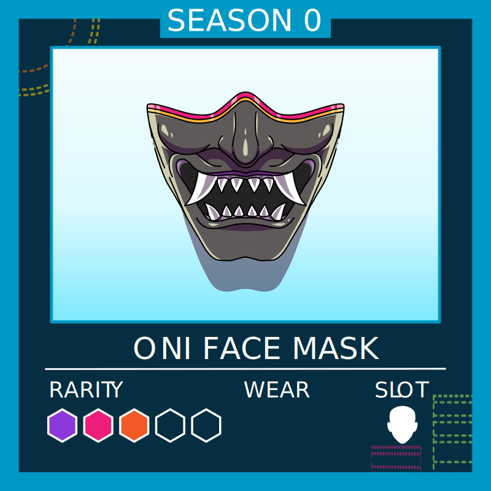

# Economy of ICP Squad 💸

The goal of this paper is to create a summary of all aspects of the ICP Squad economy so we can take the right decision to bring the economy as close as what we are targetting as possible, in the end the market will probably decide but good decision will reinforce the possibility of a positive outcome.

## Overview

One of the main goal for all members of the squad should be to accumulate as much accessories as possible.
  Accessories will give special bonus, passive income and can be seen as the speculative aspect of the game.
Accessories can only be created using materials (see recipes) and paying the minting fee or airdropped.

## Accessories

The accessories are divided into 5 categories depending on the slot they equip.

- Face 👦
- Hat 🎩
- Eyes 👀
- Body 👤
- Special/Misc (Background, jewelry, discussion bubble..) 🌈

💡 Each accessory take only one slot. Multi-slot accessories have been discussed at one point, but they are not possible to implement in the current version of icpsquad.

Once the gampeplay will be activated : for each day an accessory is equipped, it's wear value will be decreased by one; once it reachs 0 the accessory is automatically burned and desequipped from the avatar.
New accessories are minted with a wear value of 100.

## Bonus provided by accessories :

- Passive income when equipped (from the neuron).
- Increase bonus and points from both missions and other applications.
- Give access to special features and missions (To determine).

🤔 I think that our accessories should provite more benefits.

## Materials

Materials are the starting point of our economy, they are used to create accessories.

<table>
  <tr>
    <th>Name</th>
    <th>Picture</th>
    <th>  Rarity </th>
    <th> Partnership </th>
    <th> Supply </th>
    <th> Rarity index </th>
  </tr>
  <tr>
    <td> Cloth </td>
    <td>  </img> </td>
    <td> 1/5</td>
    <td> None </td>
    <td> 48 %</td>
    <td> 1  </td>
  </tr>
  <tr>
    <td> Wood </td>
    <td>  </img> </td>
    <td> 2/5</td>
    <td> None </td>
    <td> 24 %</td>
    <td> 2  </td>
  </tr>
   <tr>
    <td> Glass </td>
    <td>  </img> </td>
    <td> 3/5</td>
    <td> None </td>
    <td> 12 %</td>
    <td> 4 </td>
  </tr>
   <tr>
    <td> Metal </td>
    <td>  </img> </td>
    <td> 3/5</td>
    <td> None </td>
    <td> 12 %</td>
    <td> 4  </td>
  </tr>
   <tr>
    <td> Circuit </td>
    <td>  </img> </td>
    <td> 4/5</td>
    <td> None </td>
    <td> 3 %</td>
    <td> 16  </td>
  </tr>
   <tr>
    <td> Dfinity-stone </td>
    <td>  </img> </td>
    <td> 5/5 </td>
    <td> None </td>
    <td> 1 %</td>
    <td> 48 </td>
  </tr>
   <tr>
    <td> Cronic essence </td>
    <td>  </img> </td>
    <td> 5/5 </td>
    <td> Cronic </td>
    <td> ? </td>
    <td> ? </td>
  </tr>
   <tr>
    <td> ICPunk essence </td>
    <td>  </img> </td>
    <td> 5/5 </td>
    <td> ICPunks </td>
    <td> ? </td>
    <td> ? </td>
  </tr>
</table>

## Star system & rarity index

Each material has a rarity index associated with it, this index in inversely proportional to the supply percentage of that materials among all other materials (not taking into account partership materials).

The start system for materials is mainly cosmetic.

Each accessory has a rarity index associated with it, the rarity index is calculated using the recipe, by summing all the rarity indexs of the materials used to create the accessory.

Example : To create **Lab-glasses** you need **3** cloth, **2** wood and **1** metal.  
The rarity index of lab-glasses is hence : 3 x 1 + 2 x 2 + 1 x 4 = **11**.

The star system for accessories has the following meaning.

<table>
  <tr>
    <th> Star ⭐️ </th>
    <th> Rarity index 🔢</th>
  </tr>
  <tr>
    <th> 1  </th>
    <th> 0 - 9 </th>
  </tr>
  <tr>
    <th> 2  </th>
    <th> 10 - 19 </th>
  </tr>
  <tr>
    <th> 3  </th>
    <th> 20 - 29 </th>
  </tr>
  <tr>
    <th> 4  </th>
    <th> 30 - 50</th>
  </tr>
  <tr>
    <th> 5  </th>
    <th> 50 +</th>
  </tr>
</table>

The start system will determine the bonus given by the accessory so it is of **paramount** importance.  
TODO

## Recipe

<table>
  <tr>
    <th>Slot</th>
    <th>Name</th>
    <th>Picture</th>
    <th>Recipe</th>
    <th>Rarity (expected) </th>
    <th>Partnership</th>
    <th>Live</th>
    <th>Rarity (index) </th>
  </tr>
  <tr>
    <td> Eyes 👀 </td>
    <td> Lab-glasses</td>
    <td>  </img> </td>
    <td> Cloth : 3   Glass : 2   Metal : 1  
    <td> 2/5</td>
    <td> None </td>
    <td> Yes </td>
    <td> 11 </td>
   </tr>
  <tr>
  </tr>
   <tr>
    <td> Eyes 👀 </td>
    <td> Monocle </td>
    <td>  </img> </td>
    <td> Cloth : 2   Metal : 2   Glass : 3 </td>
    <td> 3/5</td>
    <td> None </td>
    <td> Yes </td>
    <td> 22  </td>
  </tr>
  <tr>
    <td> Eyes 👀 </td>
    <td> Matrix-glasses </td>
    <td>  </img> </td>
    <td>   Glass : 2   Metal : 1   Circuit : 1 </td>
    <td> 3/5</td>
    <td> None </td>
    <td> Yes </td>
    <td> 28 </td>
  </tr>
  <tr>
    <td> Eyes 👀 </td>
    <td> Dfinity-eyemask</td>
    <td>  </img> </td>
    <td> Cloth : 3   Wood : 2   Dfinity-stone : 1 </td>
    <td> 5/5</td>
    <td> None </td>
    <td> Yes </td>
    <td> 51 </td>
  </tr>
  <tr>
    <td> Hat 🎩 </td>
    <td> Helicap </td>
    <td>  </img> </td>
    <td> Cloth : 4   Wood : 3  </td>
    <td> 2/5</td>
    <td> None </td>
    <td> Yes </td>
    <td> 10 </td>
  </tr>
    <tr>
    <td> Hat 🎩 </td>
    <td> Marshall-hat </td>
    <td>  </img> </td>
    <td> Cloth : 3   Metal : 3  </td>
    <td> 3/5</td>
    <td> None </td>
    <td> Yes </td>
    <td> 15 </td>
  </tr>
  <tr>
    <td> Hat 🎩 </td>
    <td> Assassin-hat </td>
    <td>  </img> </td>
    <td> Cloth : 4   Metal : 4   
    <td> 3/5</td>
    <td> None </td>
    <td> No </td>
    <td> 20 </td>
  </tr>
  <tr>
    <td> Hat 🎩 </td>
    <td> Ninja-headband </td>
    <td>  </img> </td>
    <td> Wood : 3    Glass : 1   Metal : 3 </td>
    <td> 3/5</td>
    <td> None </td>
    <td> Yes </td>
    <td> 22 </td>
  </tr>
  <tr>
    <td> Hat 🎩 </td>
    <td> Shinobi-hat </td>
    <td>  </img> </td>
    <td>  Wood : 5   Metal : 5 </td>
    <td> 4/5</td>
    <td> None </td>
    <td> No </td>
    <td> 30 </td>
  </tr>
  <tr>
    <td> Hat 🎩 </td>
    <td> Dark-magic-hood </td>
    <td>  </img> </td>
    <td> Cloth : 1   Metal : 8    Dfinity-stone : 1 </td>>
    <td> 5/5</td>
    <td> None </td>
    <td> No </td>
    <td> 81 </td>
  </tr>
  <tr>
    <td> Hat 🎩 </td>
    <td> Astro-helmet </td>
    <td>  </img> </td>
    <td> Glass : 2   Metal : 3   Circuit : 2   Dfinity-stone : 1 </td>
    <td> 5/5</td>
    <td> None </td>
    <td> No </td>
    <td> 100 </td>
  </tr>
  <tr>
    <td> Face 👦 </td>
    <td> Oni-half-mask </td>
    <td>  </img> </td>
    <td> Wood : 4   Metal : 4 </td>
    <td> 3/5</td>
    <td> None </td>
    <td> Yes </td>
    <td> 100 </td>
  </tr>
  <tr>
    <td> Face 👦 </td>
    <td> Facemask </td>
    <td>  </img> </td>
    <td> Cloth : 4   Metal : 6 </td>
    <td> 3/5</td>
    <td> None </td>
    <td> Yes </td>
    <td> 28 </td>
  </tr>
  <tr>
    <td> Face 👦 </td>
    <td> Astro-helmet </td>
    <td>  </img> </td>
    <td> ? </td>
    <td> 5/5</td>
    <td> ICPunks </td>
    <td> No </td>
    <td> ? </td>
  </tr>
  <tr>
    <td> Body 👤 </td>
    <td> Helicap-tshirt </td>
    <td>  </img> </td>
    <td> Cloth : 4   Wood : 4 </td>
    <td> 2/5</td>
    <td> None </td>
    <td> No </td>
    <td> 12 </td>
  </tr>
  <tr>
    <td> Body 👤 </td>
    <td> Assassin-cap </td>
    <td>  </img> </td>
    <td> Cloth : 4   Glass : 3   Metal : 2 </td>
    <td> 3/5</td>
    <td> None </td>
    <td> No </td>
    <td> 24 </td>
  </tr>
  <tr>
    <td> Body 👤 </td>
    <td> Lab-coat </td>
    <td>  </img> </td>
     <td> Glass : 3    Circuit : 1 </td>
    <td> 3/5</td>
    <td> None </td>
    <td> No </td>
    <td> 28 </td>
  </tr>
  <tr>
    <td> Body 👤 </td>
    <td> Shinobi-jacket </td>
    <td>  </img> </td>
    <td> ? </td>
    <td> 5/5</td>
    <td> None </td>
    <td> No </td>
    <td> ? </td>
  </tr>
  <tr>
    <td> Body 👤 </td>
    <td> Yakuza-oni-jacket </td>
    <td>  </img> </td>
    <td> ? </td>
    <td> 5/5</td>
    <td> None </td>
    <td> No </td>
    <td> ? </td>
  </tr>
  <tr>
    <td> Body 👤 </td>
    <td> Devil-jacket </td>
    <td>  </img> </td>
    <td> ? </td>
    <td> 5/5</td>
    <td> None </td>
    <td> No </td>
    <td> ? </td>
  </tr>
  <tr>
    <td> Body 👤 </td>
    <td> Dystopian-jacket </td>
    <td>  </img> </td>
    <td> ? </td>
    <td> 5/5</td>
    <td> None </td>
    <td> No </td>
    <td> ? </td>
  </tr>
  <tr>
    <td> Body 👤 </td>
    <td> Magic-cap </td>
    <td>  </img> </td>
    <td> ? </td>
    <td> 5/5</td>
    <td> None </td>
    <td> No </td>
    <td> ? </td>
  </tr>
  <tr>
    <td> Body 👤 </td>
    <td> Astro-body </td>
    <td>  </img> </td>
    <td> ? </td>
    <td> 5/5</td>
    <td> None </td>
    <td> No </td>
    <td> ? </td>
  </tr>
</table>

## Minting fee

## Legendary accessories

## ICP Squad neuron

## Passive income

## Active income (missions)

## Our vision

## Burning
