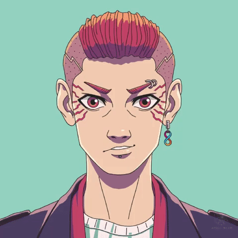

# 👨💼 Avatar

## Characters&#x20;

### Dual NFT-system&#x20;

This project consists of a **dual-NFT** game with characters and accessories.&#x20;

Characters are composable and dynamic NFTs, meaning they can evolve, change their properties and wear accessories that will impact their visual appearance.&#x20;

Characters are avatars that you can fully customise with a different assortiments of visual properties. They are stored as NFTs using the Internet Computer blockchain.&#x20;

Minting your avatar is your ticket to join the squad.

### Low barrier to entry&#x20;

This project aims to be inclusive and promote engagement on the Internet Computer, so it needs to stay accessible to anyone who want to support and join the squad. We understand that speculation is an inherent part of crypto-economies but this game will be designed so that everyone can play, regarding of their own economical means.&#x20;

Keeping the floor price of characters low, we are offering everyone the opportunity to get a unique avatar on the IC that they'll be able to use across multiple dApps.

The current price to mint a character is **1 ICP**.

## Creating an avatar

### Requirements

To be able to mint your avatar you'll need the followings.

* An Internet Computer compatible wallet ( We recommend using[ Plug wallet](https://plugwallet.ooo/))
* A balance of 1 ICP (+ the transaction fee of 0.0001 ICP). ICP is the currency of the Internet Computer network.[ Learn how to buy](https://www.dfinitycommunity.com/how-to-buy-icp-a-complete-guide-to-investing-in-internet-computer-cryptocurrency/).
* A stable internet connexion
* Make sure you know what you are getting into. We only process refunds for technical issues.

### **Step 1 : Head over to our official website.**

Just click on 'Create avatar' and you will be redirected to the minting page.

### **Step 2 : Customise your look.**

Hey, it's not like in the real life. Here you can create the look that fits your best.

Pick a category on the right and choose among the several different options offered to you. You can even choose the **color of your eyes**, if you wish to. We usually recommend sticking to the suggested color options, to keep some harmony but you can pick any color with the color picker.

If you are not feeling inspired, you can get some suggestions using the **green shuffle button.** &#x20;

Take your time, don't forget that your avatar will be used in several places to represent you, so pick wisely.

### **Step 3 : Pay the minting fee**

Once you ready, click and head over to the next step. This is where you'll need to login with your wallet.&#x20;

After being logged in, you'll be prompted to pay **1 ICP** to continue further.&#x20;

_Note : At this point If you already paid during the preorder but never had a chance to mint your avatar, you can skip the paiement and click on the second button. If you have no idea what is the preorder this is not for you._&#x20;

Then you will need to confirm the payment using your wallet. Make sure your balance is enough.&#x20;

After having validated  the system will validate your payment. This step will requires approximately 10 seconds.

.png>)

### **Step 4 : Mint your avatar**

After the payment has been confirmed you'll need to validate one last time to send the mint request. ****&#x20;

 .png>)

As in the picture, you will likely see a warning message from your wallet. This is due to a technical issue that we are currently investigating with the wallet provider.

### **Step 5 : Receive your avatar in your wallet.**

After waiting a few seconds, you will see your avatar appearing in your wallet under the "ICP Squad" section.&#x20;

The number that you will see corresponds to the minting number of your avatar.

### **Next steps**

You are now officially part of the squad, welcome!&#x20;

Creating your avatar is only the first step. Here's a few suggestion for your next move.

* Join our [Discord.](https://discord.gg/JfRvPTpceS)
* Share your avatar on Twitter.&#x20;
* Take a look at the mission board.
* Learn about accessories and scores.

### Potential issues&#x20;

If you are experiencing any issue during the process. Please head over to our [feedback channel ](https://discord.gg/CZ9JgnaySu)and post your request. Make sure to respect the format.
