# **ICP Squad : economy**

The goal of this paper is to create a summary of all aspects of the ICP Squad economy so we can take the right decision to bring the economy as close as what we are targetting as possible, in the end the market will decide but good decision will reinforce the possibility of a positive outcome.

## **Overview** 👀

One of the main goal for all members of the squad should be to accumulate as much accessories as possible.
  Accessories will give special bonus, passive income and can be seen as the speculative aspect of the game.
Accessories can only be created using materials (see recipes) and paying the minting fee or airdropped.

## **Accessories** 🧢

The accessories are divided into 5 categories depending on the slot they equip.

- Face 👦
- Hat 🎩
- Eyes 👀
- Body 👤
- Misc (Background, jewelry, discussion bubble..) 🌈

💡 Each accessory take only one slot. Multi-slot accessories have been discussed at one point, but they are not possible to implement with the current source code.

Once the gampeplay will be activated : for each day an accessory is equipped, it's wear value will be decreased by one; once it reachs 0 the accessory is automatically burned and desequipped from the avatar.
New accessories are minted with a wear value of 100.

## Bonus provided by accessories :

- Passive income when equipped (from the neuron).
- Increase bonus and points from both missions and other applications.
- Give access to special features and missions (To determine).

## **Materials** 🧱

Materials are the starting point of our economy, they are used to create accessories.

**Inflation** : monthly aidropped (under our control).  
**Deflation** : burned to create accessories (partially under our control, we choose the recipes not what people will mint).

<table>
  <tr>
    <th> Name </th>
    <th> Picture </th>
    <th> Supply </th>
    <th> Rarity index </th>
  </tr>
  <tr>
    <td> Cloth </td>
    <td>  </img> </td>
    <td> 48 %</td>
    <td> 1  </td>
  </tr>
  <tr>
    <td> Wood </td>
    <td> </img> </td>
    <td> 24 %</td>
    <td> 2  </td>
  </tr>
   <tr>
    <td> Glass </td>
    <td> </img> </td>
    <td> 12 %</td>
    <td> 4 </td>
  </tr>
   <tr>
    <td> Metal </td>
    <td> </img> </td>
    <td> 12 %</td>
    <td> 4  </td>
  </tr>
   <tr>
    <td> Circuit </td>
    <td> </img> </td>
    <td> 3 %</td>
    <td> 16  </td>

  </tr>
   <tr>
    <td> Dfinity-stone </td>
    <td> </img></td>
    <td> 1 %</td>
    <td> 48 </td>

  </tr>
   <tr>
    <td> Cronic-essence </td>
    <td> 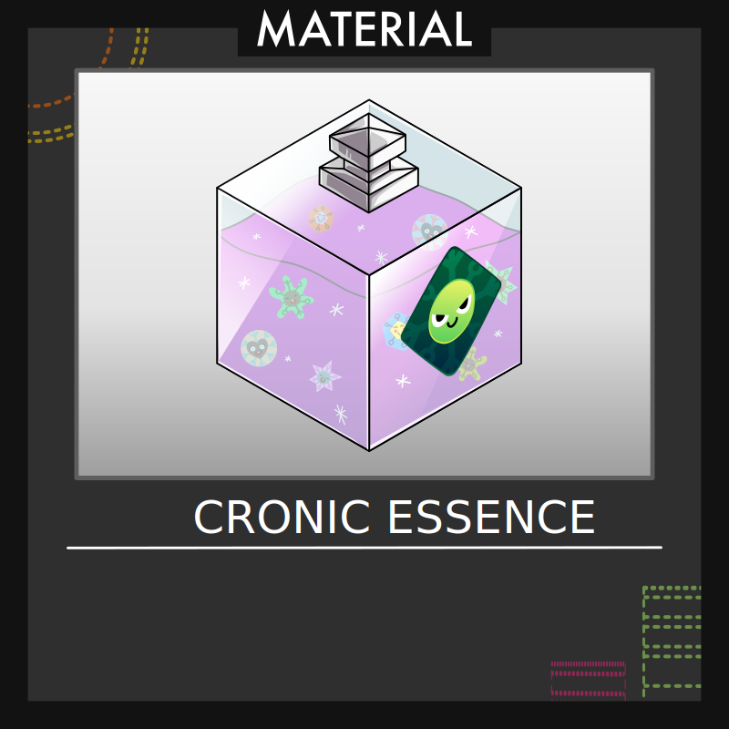 </img> </td>
    <td> Unkown </td>
    <td> ? </td>
  </tr>
   <tr>
    <td> Punk-essence </td>
    <td> 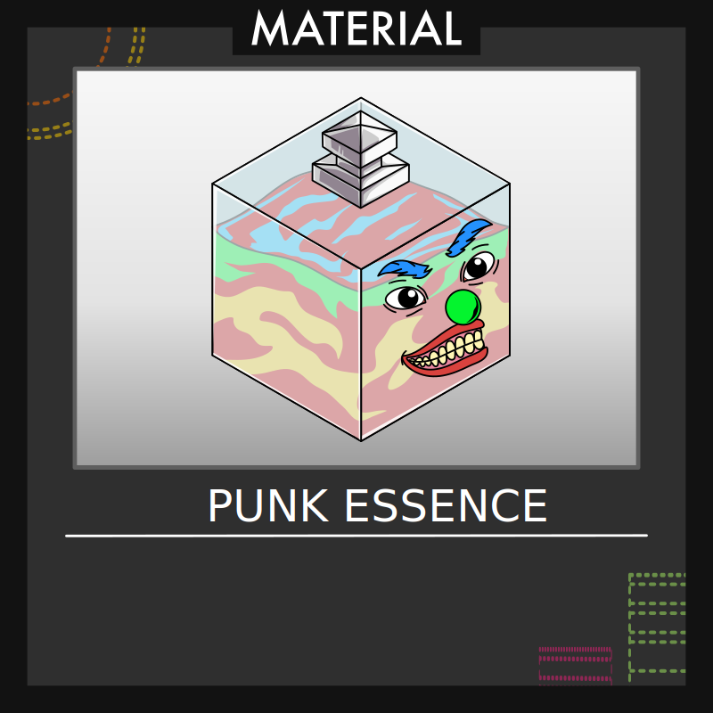 </img> </td>
    <td> Unkown </td>
    <td> ?</td>
  </tr>
</table>

## **Star system & rarity index** ✨

Each material has a rarity index associated with it, this index in inversely proportional to the supply percentage of that material among all other materials.

Each accessory has a rarity index associated with it, the rarity index is calculated using the recipe, by summing all the rarity indexs of the materials used to create the accessory.

For instance : to create **Lab-glasses** you need **3** cloth, **2** wood and **1** metal.  
The rarity index of **Lab-glasses** is : 3 x 1 + 2 x 2 + 1 x 4 = **11**.

Each range of rarity index corresponds to a number of starts.  
The start system will determine the bonus given by the accessory.

<table>
  <tr>
    <th> Star ⭐️ </th>
    <th> Rarity index 🔢</th>
  </tr>
  <tr>
    <th> 1  </th>
    <th> 0 - 19 </th>
  </tr>
  <tr>
    <th> 2  </th>
    <th> 20 - 29 </th>
  </tr>
  <tr>
    <th> 3  </th>
    <th> 30 - 39 </th>
  </tr>
  <tr>
    <th> 4  </th>
    <th> 40 - 45 </th>
  </tr>
  <tr>
    <th> 5  </th>
    <th> 45 +</th>
  </tr>
</table>

## **Recipe** 🧪

Acessories can be minted following a recipe : combining some materials and paying the minting fee.
Some accessories have fixed supply, others have a rarity index that depends on the materials needed to create them.

The number of accessories in circulation will be greatly dependent on the number of materials airdropped monthly.

Objectives :

- An average recipe should be composed of 8 materials.
- We want accessories that have 5 stars to be the most interesting one (in terms of how much they increase the **style score** compared to how hard it will be to get one).
- Number of materials airdropped monthly should be such that :
  - Almost everyone can get something : even if it's a cloth and it's worth 0.10 ICP that will be a nice surprise for people to see something in the **Airdrop** section.
  - Only the top 20% of people can be fully equipped.

The "actual" rarity of materials also depends on how much materials are needed to complete some recipes.  

Issue ⚠️

We have 24 (base) accessories, assuming 8 materials per recipe : 192 materials.  
We have 6 different types of (base) materials 192/6 = 32.  
Following a linear distribution each material should be involved 32 times in a recipe.  
The issue is that the dfinity-stone rarity index is too high to fit into the star-system... (basically if we put the Dfinity-stone in one material then the star system is automatically 5)  
We choosed to increase the rarity of the low-level material (Cloth, Wood) and decrease the rarity of the high level materials (Metal, Circuit) by changing the occurence at wich they appear into recipes :

Cloth (x2) = 64 occurrences.  
Wood (x1.5) = 48 occurences.  
Metal (x1) = 32 occurences.  
Glass (x1) = 32 occurrences.  
Circuit(x0.5) = 16 occurences.  
Dfinity-stone(x0.25) = 8 occurences.  

Total occurences = 200 occurences (~192).

This means that the "real" rarity of the cloth is now increased by a factor of 2 whereas the "real" rarity of the Dfinity-stone has now been decreased by a factor of 4 !

### <u> **Traditional** </u>

<table>
  <tr>
    <th>Slot</th>
    <th>Name</th>
    <th>Picture</th>
    <th>Recipe</th>
    <th>Rarity (index) </th>
    <th>Stars</th>
  </tr>
  <tr>
    <td> Body 👤 </td>
    <td> Assassin-cap </td>
    <td> 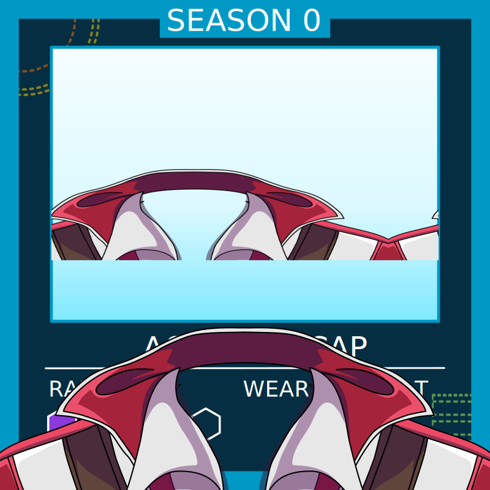 </img> </td>
    <td> Wood : 2   Glass : 2   Metal : 2 </td>
    <td> 20 </td>
    <td> 2/5</td>
  <tr>
  <tr>
    <td> Body 👤 </td>
    <td> Astro-suit </td>
    <td> 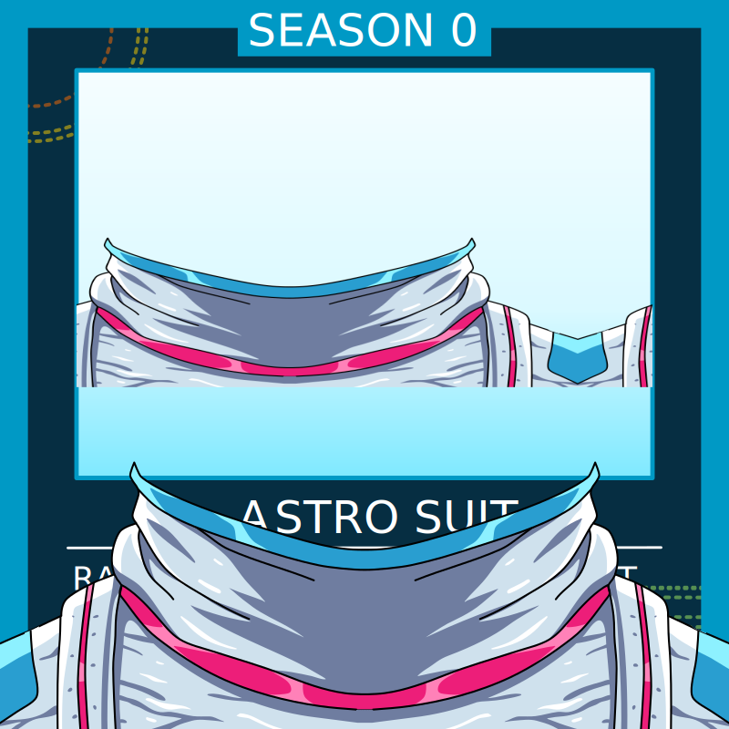 </img> </td>
    <td> Metal : 1   Glass : 1   Circuit : 1   Dfinity-stone : 1 
    <td> 72 </td>
    <td> 5/5</td>
  </tr>
  <tr>
    <td> Body 👤 </td>
    <td> Devil-jacket </td>
    <td>  </img> </td>
    <td> Cloth : 6   Wood : 6   Metal : 6    </td>
    <td> 42 </td>
    <td> 4/5</td>
  </tr>
   <td> Body 👤 </td>
    <td> Helicap-tshirt </td>
    <td> 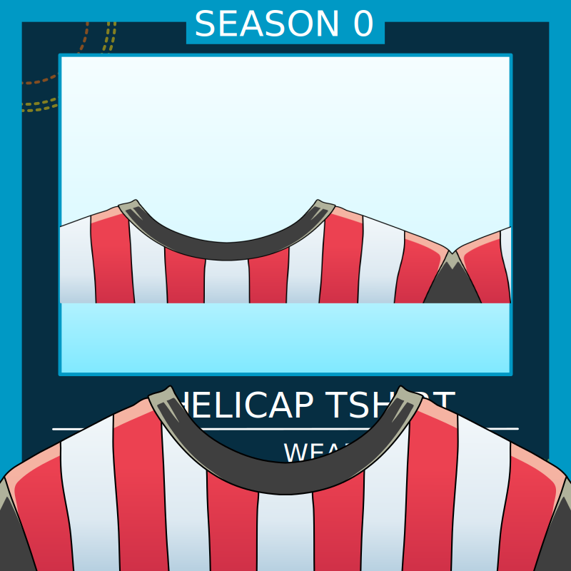 </img> </td>
    <td> Cloth : 4   Wood : 4 </td>
    <td> 12 </td>
    <td> 1/5</td>
  </tr>
  </tr>
  <tr>
    <td> Body 👤 </td>
    <td> Lab-coat </td>
    <td> 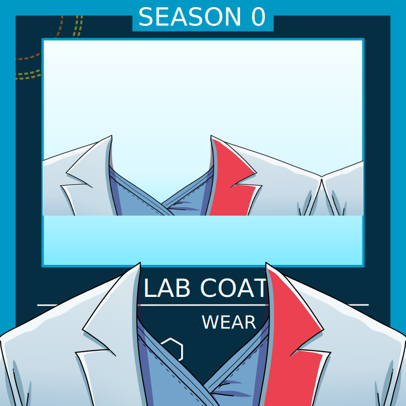 </img> </td>
    <td> Cloth : 3   Glass : 3    Circuit : 1 </td>
    <td> 31 </td>
    <td> 3/5</td>
  </tr>
  <tr>
    <td> Body 👤 </td>
    <td> Magic-cap </td>
    <td> 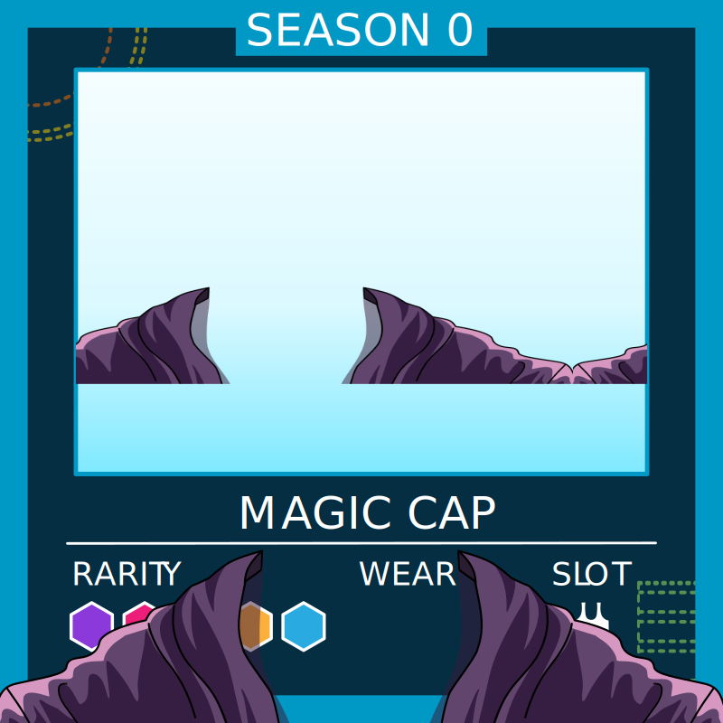 </img> </td>
    <td> Cloth : 4   Circuit : 1   Dfinity-stone : 1 </td>
    <td> 68 </td>
    <td> 5/5</td>
  </tr>
    <td> Body 👤 </td>
    <td> Shinobi-suit </td>
    <td> 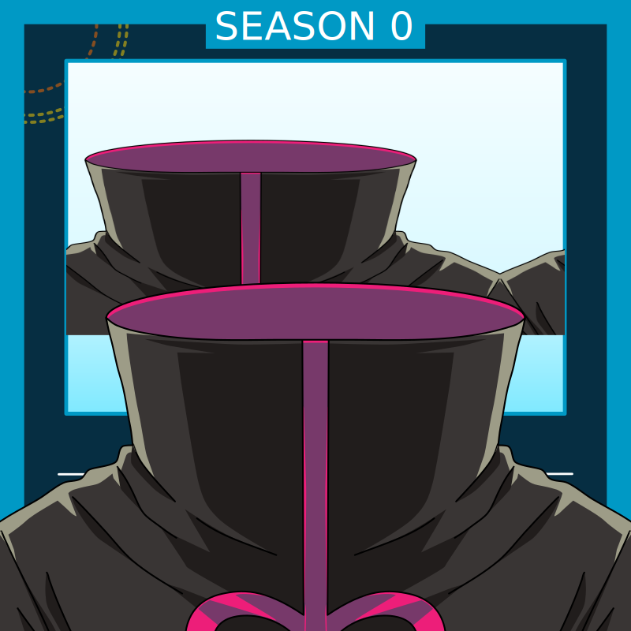 </img> </td>
    <td> Cloth : 2   Wood : 2   Metal : 3   Circuit : 1  </td>
    <td> 34 </td>
    <td> 3/5</td>
  </tr>
  <tr>
    <td> Body 👤 </td>
    <td> Street-jacket </td>
    <td> 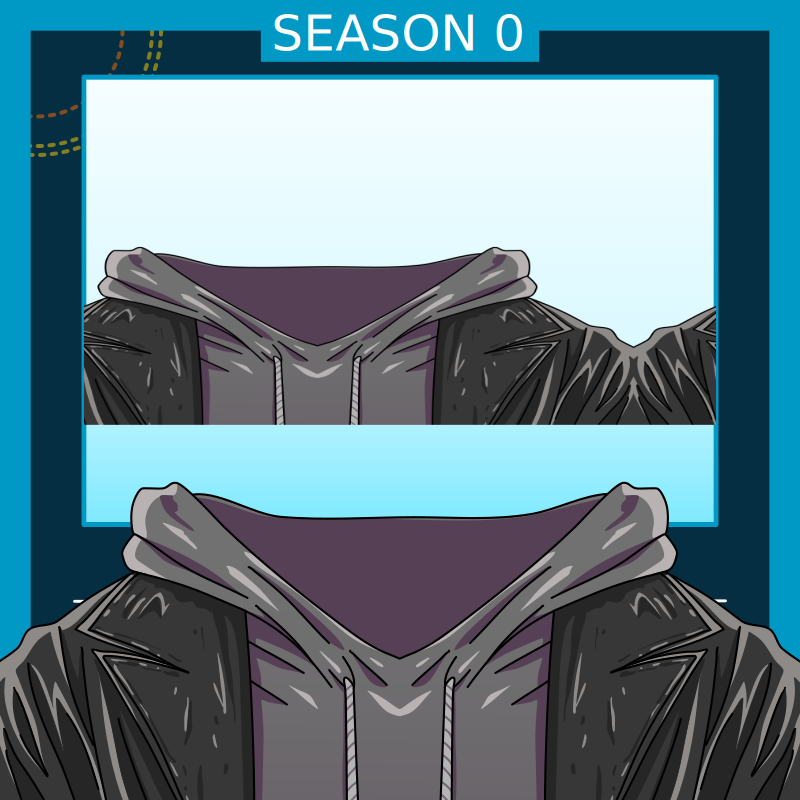 </img> </td>
    <td> Cloth : 3   Glass : 2   Circuit : 2 </td>
    <td> 43 </td>
    <td> 4/5 </td>
  </tr>
  <tr>
    <td> Body 👤 </td>
    <td> Yakuza-suit </td>
    <td> 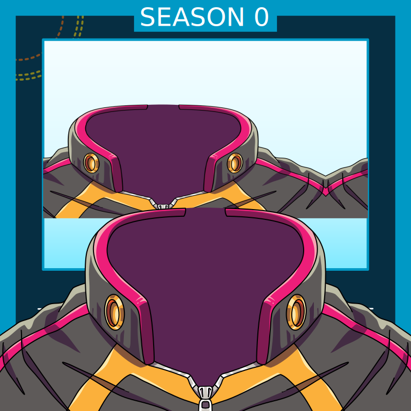 </img> </td>
    <td> Cloth : 3   Wood : 2   Glass : 3   Circuit : 1 </td>
    <td> 35 </td>
    <td> 3/5</td>
  </tr>
  <tr>
    <td> Eyes 👀 </td>
    <td> Dfinity-eyemask</td>
    <td> 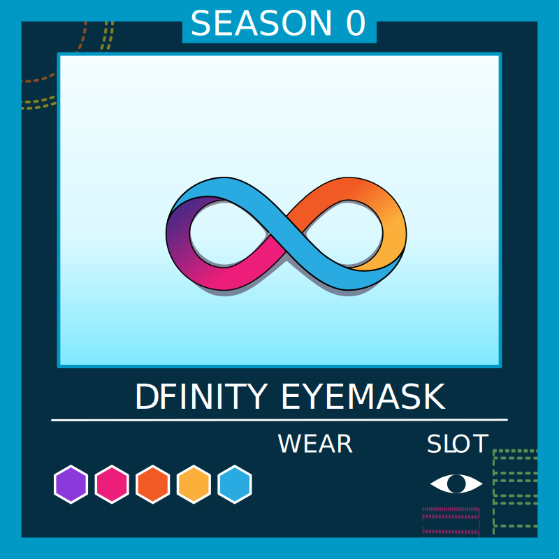 </img> </td>
    <td> Cloth : 3   Wood : 2   Dfinity-stone : 1 </td>
    <td> 55 </td>
    <td> 5/5</td>
  </tr>
  <tr>
    <td> Eyes 👀 </td>
    <td> Lab-glasses</td>
    <td> 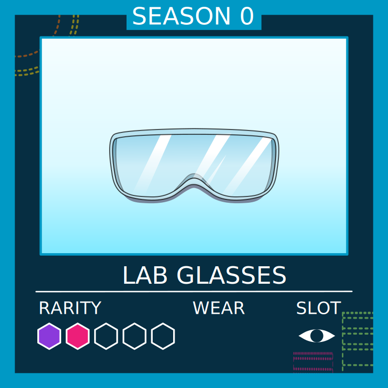 </img> </td>
    <td> Cloth : 4   Glass : 3   Circuit : 1
    <td> 32 </td>
    <td> 3/5</td>
   </tr>
  <tr>
    <td> Eyes 👀 </td>
    <td> Monocle </td>
    <td> 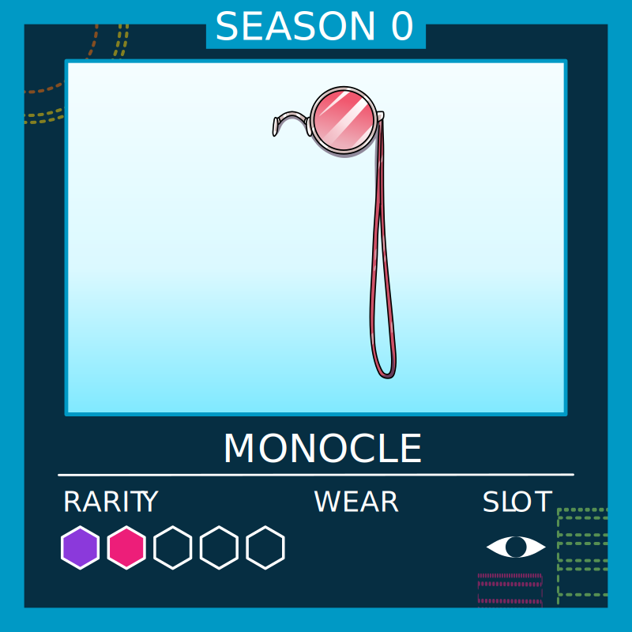 </img> </td>
    <td> Cloth : 2   Metal : 2   Glass : 3 </td>
    <td> 22  </td>
    <td> 2/5</td>
  </tr>
  <tr>
    <td> Eyes 👀 </td>
    <td> Sunglasses </td>
    <td> 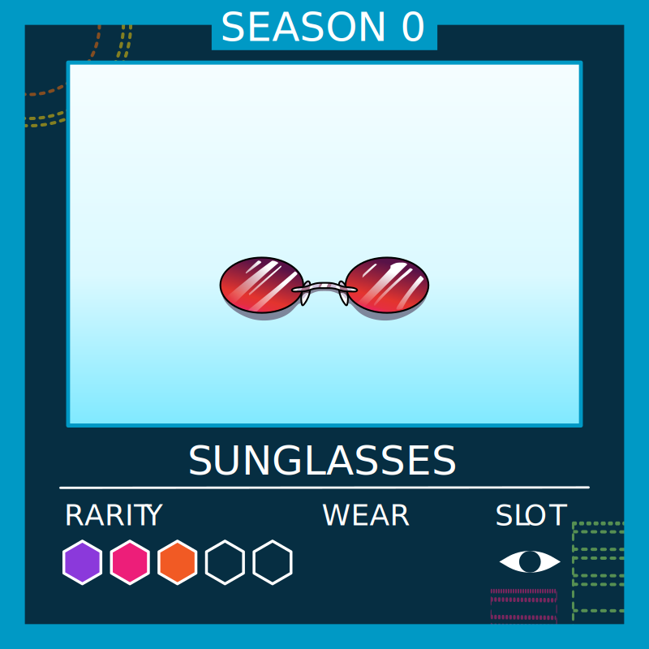 </img> </td>
    <td> Cloth : 2   Metal : 1    Glass : 3   Circuit : 1 </td>
    <td> 34 </td>
    <td> 3/5</td>
  </tr>
  <tr>
    <td> Face 👦 </td>
    <td> Facemask </td>
    <td> 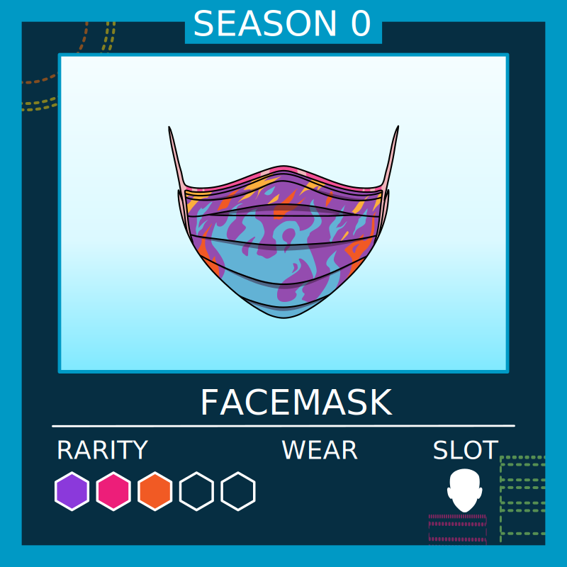 </img> </td>
    <td> Cloth : 4   Metal : 3   Circuit : 1 </td>
    <td> 32 </td>
    <td> 3/5</td>
  </tr>
    <tr>
    <td> Face 👦 </td>
    <td> Oni-face-mask </td>
    <td> 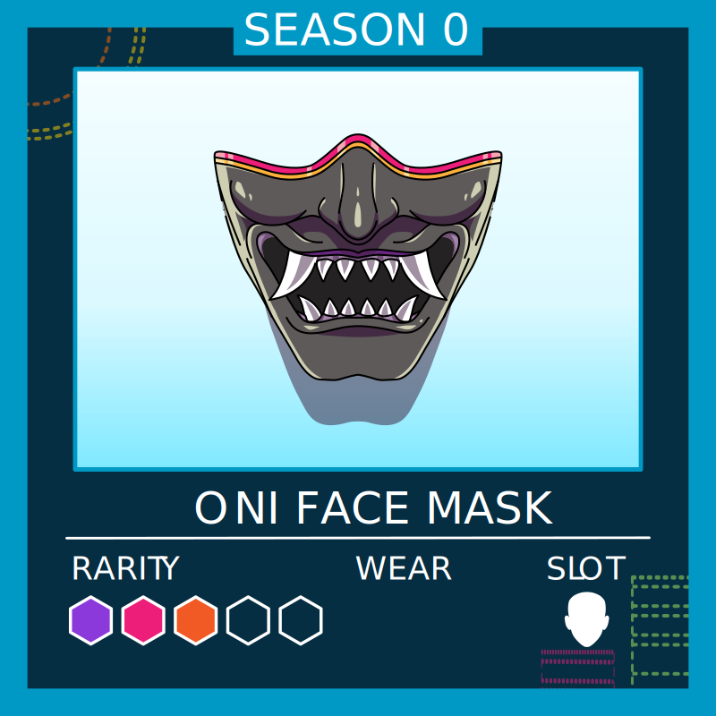 </img> </td>
    <td> Wood : 4   Metal : 3   Circuit : 1 </td> 
    <td> 36 </td>
    <td> 3/5</td>
  </tr>
  <tr>
    <td> Hat 🎩 </td>
    <td> Assassin-hood </td>
    <td>  </img> </td>
    <td> Cloth : 2   Wood : 2   Glass : 2   Metal : 3   
    <td> 26 </td>
    <td> 2/5</td>
  </tr>
  <tr>
    <td> Hat 🎩 </td>
    <td> Astro-helmet </td>
    <td> 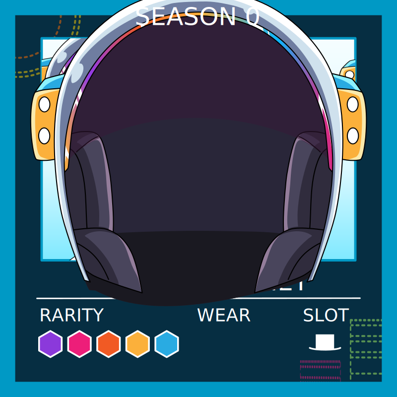 </img> </td>
    <td> Glass : 2   Circuit : 2   Dfinity-stone : 1 </td>
    <td> 88 </td>
    <td> 5/5</td>
  </tr>
  <tr>
    <td> Hat 🎩 </td>
    <td> Helicap </td>
    <td> 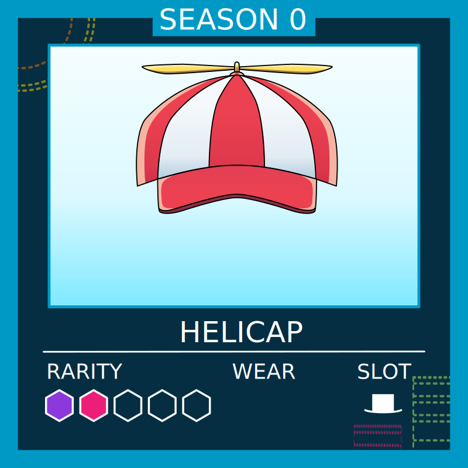 </img> </td>
    <td> Cloth : 4   Wood : 4   Circuit : 1 </td>
    <td> 28 </td>
    <td> 2/5</td>
  </tr>
  <tr>
    <td> Hat 🎩 </td>
    <td> Magic-hood </td>
    <td> 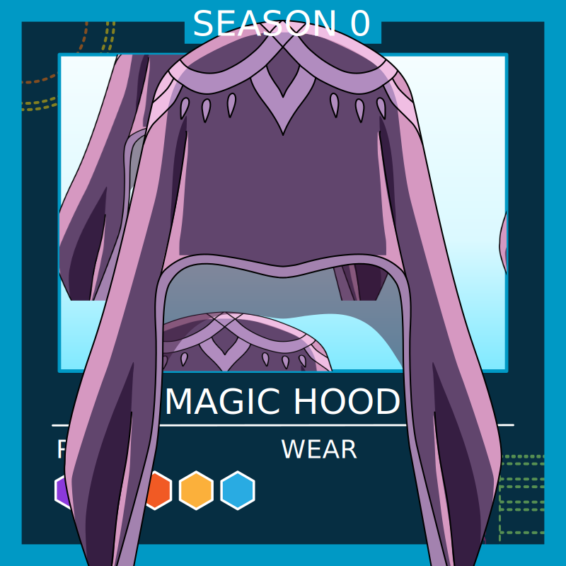 </img> </td>
    <td> Cloth : 4   Circuit : 1   Dfinity-stone : 1 </td>
    <td> 68 </td>
    <td> 5/5</td>
  </tr>
  <tr>
    <td> Hat 🎩 </td>
    <td> Marshall-hat </td>
    <td> 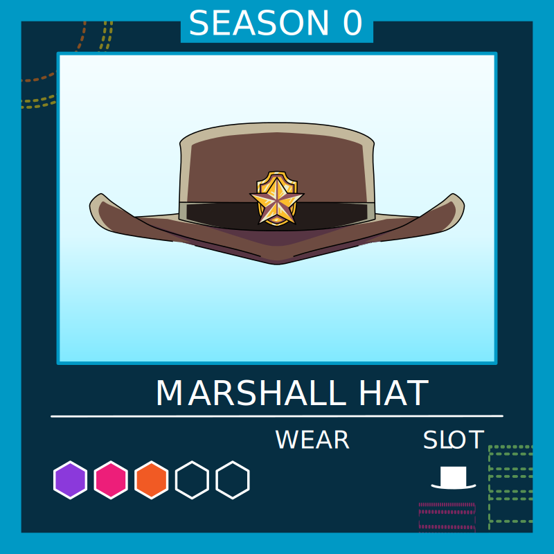 </img> </td>
    <td> Wood : 3   Metal : 3   Glass : 3  </td>
    <td> 30 </td>
    <td> 3/5</td>
  </tr>
  <tr>
    <td> Hat 🎩 </td>
    <td> Ninja-headband </td>
    <td> 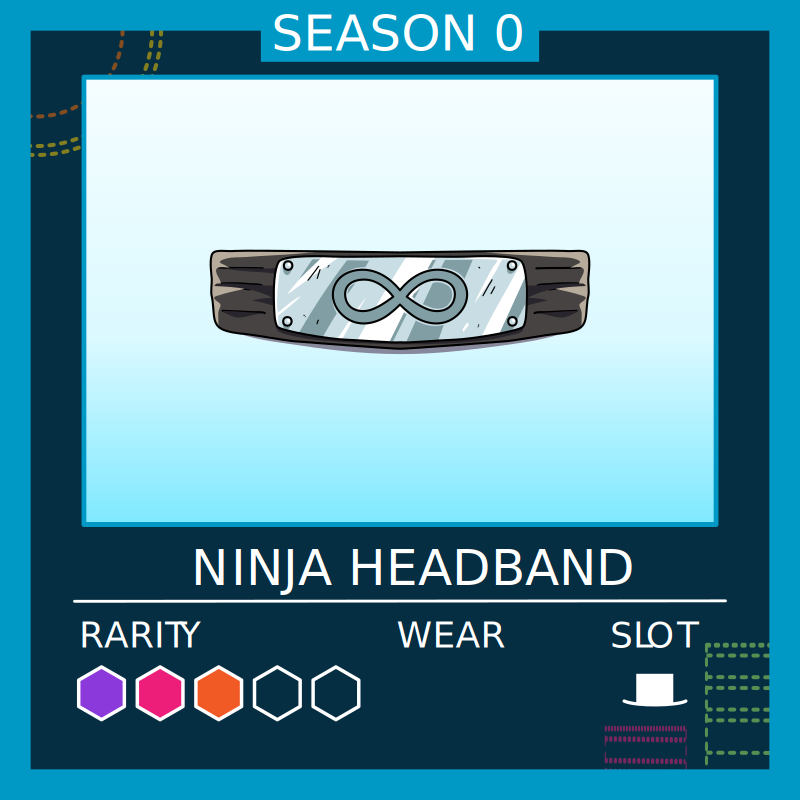 </img> </td>
    <td> Cloth : 3   Wood : 4   Metal : 1   Circuit : 1 </td>
    <td> 31 </td>
    <td> 3/5</td>
  </tr>
  <tr>
    <td> Hat 🎩 </td>
    <td> Shinobi-hat </td>
    <td> 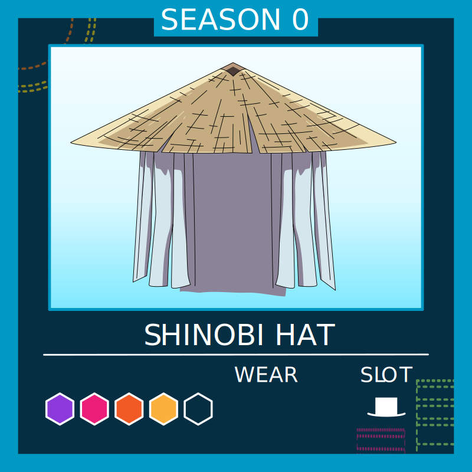 </img> </td>
    <td> Cloth : 5   Wood : 5 </td>
    <td> 15 </td>
    <td> 1/5</td>
  </tr>
  <tr>
    <td> Misc 🌈 </td>
    <td> Snowfall </td>
    <td>  </img> </td>
    <td>  Wood : 3   Glass : 2   Metal : 1   Dfinity-stone : 1 </td>
    <td>  66 </td>
    <td>  5/5 </td>
  </tr>
  <tr>
    <td> Misc 🌈 </td>
    <td> Sunrise </td>
    <td>  </img> </td>
    <td> Wood : 3   Metal : 2    Glass : 1   Dfinity-stone : 1 </td>
    <td> 66 </td>
    <td> 5/5  </td>
  </tr>
</table>

### <u> **Limited edition** </u>

<table>
  <tr>
    <th>Slot</th>
    <th>Name</th>
    <th>Picture</th>
    <th>Recipe</th>
    <th> Partnership </th>
    <th> Supply </th>
  </tr>
  <tr>
    <td> Hat 🎩 </td>
    <td> Mortaboard-hat </td>
    <td>  </img> </td>
    <td> Airdropped. </td>
    <td> Motoko-bootcamp </td>
    <td> ? </td>
  </tr>
  <tr>
    <td> Body 👤 </td>
    <td> Bootcamp-solider </td>
    <td> 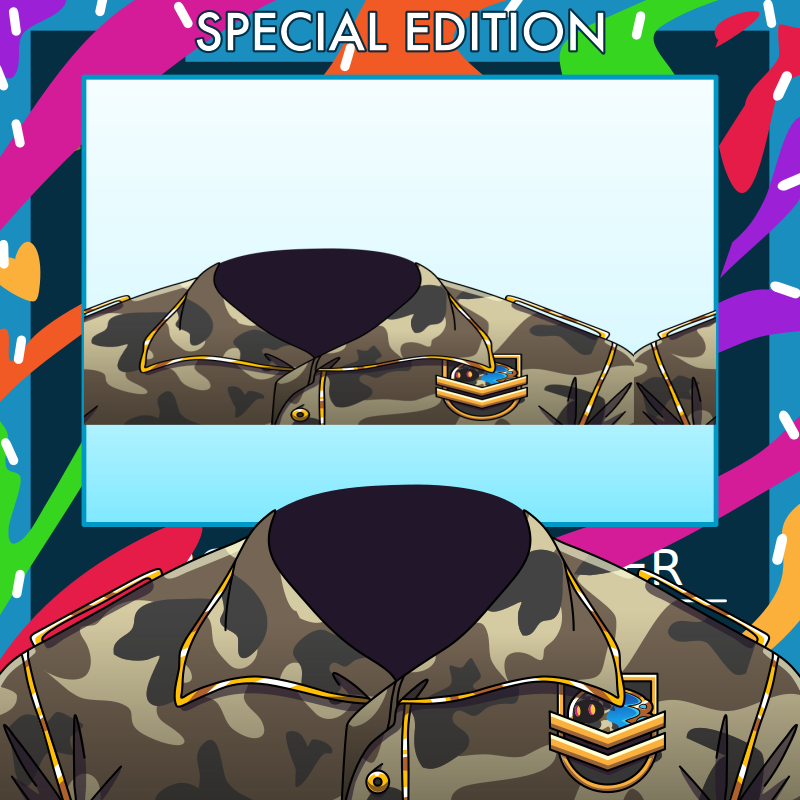 </img> </td>
    <td> Airdropped. </td>
    <td> Motoko-bootcamp </td>
    <td> ? </td>
  </tr>
  <tr>
    <td> Body 👤 </td>
    <td> Cronic-tshirt </td>
    <td> 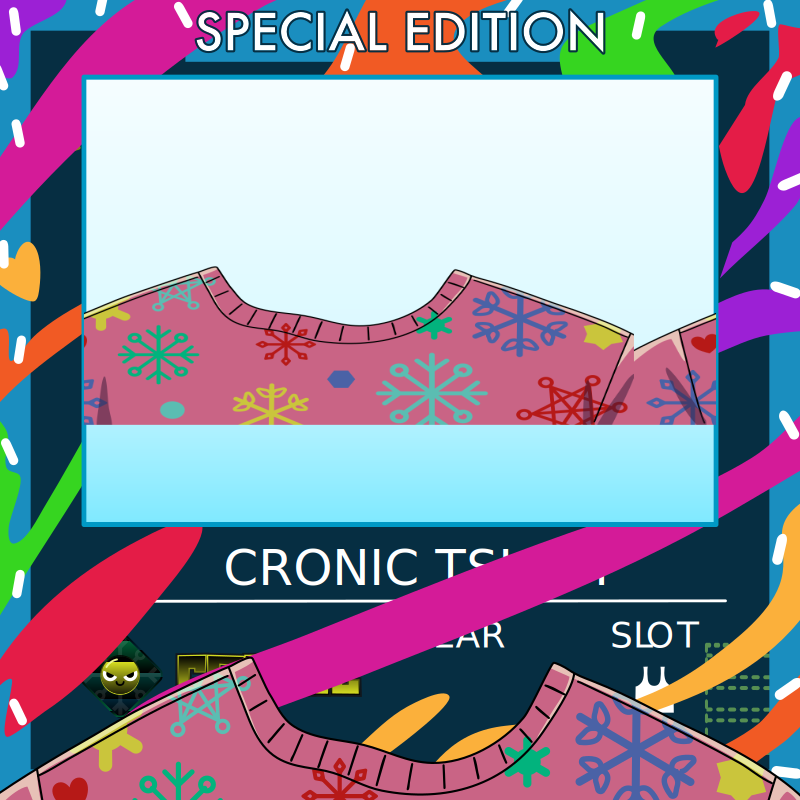 </img> </td>
    <td> Cronic-essence : 4   Cloth : 3   Wood : 1   </td>
    <td> Cronic </td>
    <td> Limited </td>
  </tr>
  <tr>
    <td> Eyes 👀 </td>
    <td> Cronic-eyepatch </td>
    <td> 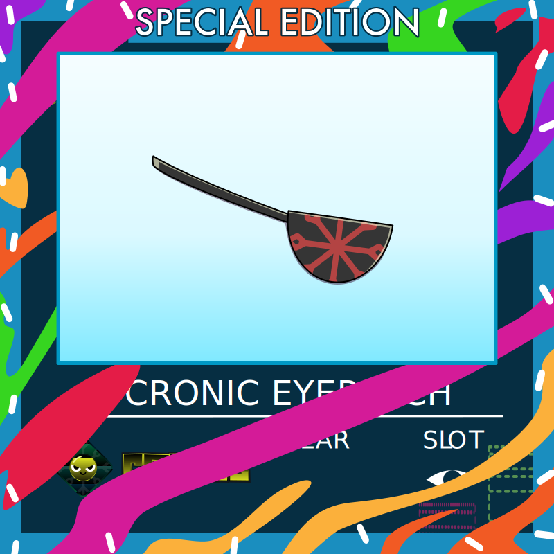 </img> </td>
    <td> Croncic-essence : 2   Wood : 3   Cloth : 3 </td>
    <td> Cronic </td>
    <td> Limited </td>
  </tr>
    <tr>
    <td> Misc 🌈</td>
    <td> Cronic-hypnose </td>
    <td> 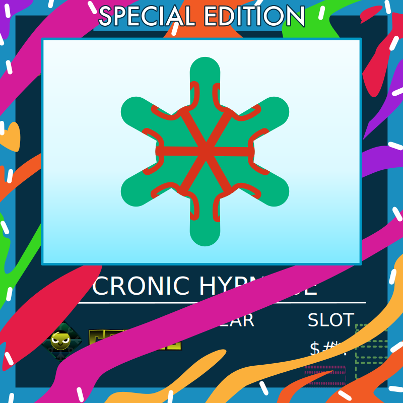 </img> </td>
    <td> Cronic-essence : 3   Dfinity-stone : 1 </td>
    <td> Cronic </td>
    <td> Limited </td>
  </tr>
    <tr>
    <td> Misc 🌈 </td>
    <td> Cronic-wallpaper </td>
    <td> 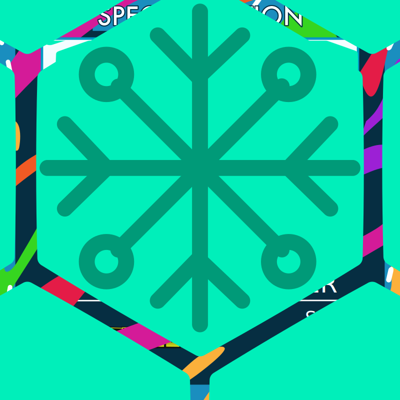 </img> </td>
    <td> Cronic-essence : 3   Glass : 2   Circuit : 1 </td>
    <td> Cronic </td>
    <td> Limited </td>
  </tr>
  <tr>
    <td> Face 👦 </td>
    <td> Punk-mask </td>
    <td> 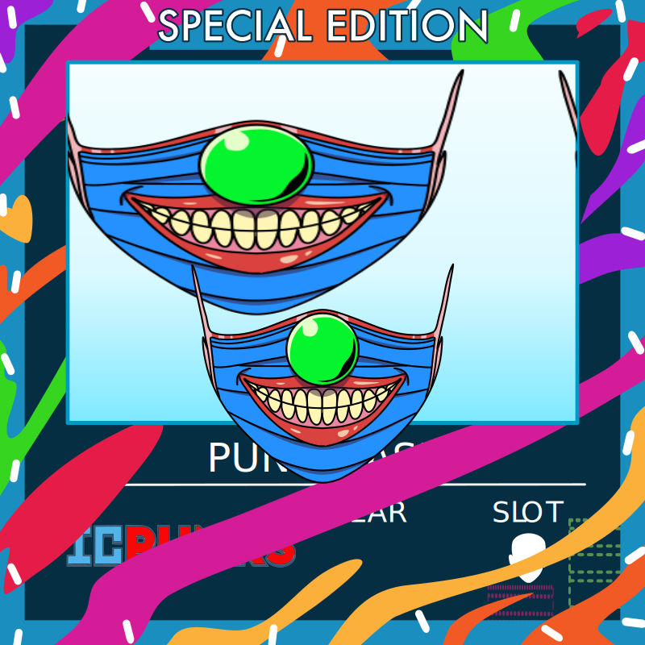 </img> </td>
    <td> Punk-essence : 3   Cloth : 3   Metal : 2 </td>
    <td> ICPunk </td>
    <td> Limited </td>
  </tr>
  <tr>
    <td> Eyes 👀 </td>
    <td> Punk-glasses </td>
    <td> 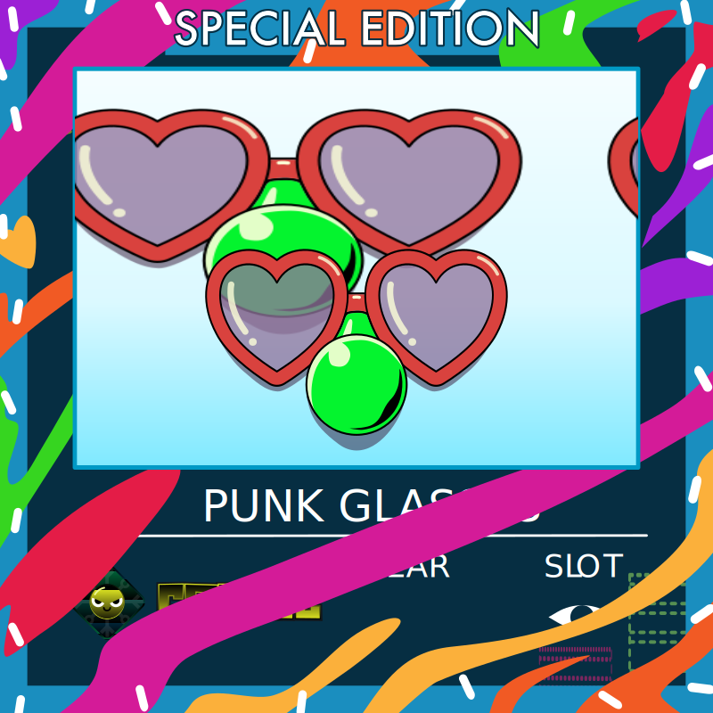 </img> </td>
    <td> Punk-essence : 3   Wood : 3   Glass : 2 </td>
    <td> ICPunk </td>
    <td> Limited </td>
  </tr>

</table>

## Minting fee 💲

Before minting an accessory, a **minting fee** will be asked.  
This fee has been voted on by the community to be initialized at **0.5 ICP**.  
The fee will evolve to adjust the rate of accessories and can be used to adujst our economy when needed to avoir hyper-inflation of accessories.

## ICP Squad neuron 🧠

An 8-years locked neuron.

**How do we fund it ?**

- Minting fee
- Legendary accessories sale.
- Other : mission fee ?

**How do we harvest it and how do we distribute rewards ?**

- Harvested every month / every week ?
- Rewards put in a pool that is distributed to all accessory holders ?
- Passive rewards only ?

**How is it governed ?**

We currently don't have a governance framework, we will probably follow a known actor of the NNS (Dfinity foundation/ ICA / Maximalist network) until we developed our own governance board (as discussed with missions/motoko bootcamp).

## Passive income

Every month/week/day ?

Passive income for accessory holders only ?
Prize pool coming from the neuron harvested rewards.

How much ?
Depends on number of starts + random factor.

## Active income

Every month

- Missions : ICP Squad or others : quizz/tasks.
- Application score : DSCVR/Gigaverse Labs/Cronic

Prize pool : materials and accessories only ?

## Targets 🎯

- Low barrier to entry : this project aims to promote engagement on the Internet Computer to outside persons and should stay accessible to anyone who wants to support the ecosystem.

  - Avatar minting should remain at low price : **1 ICP**.
  - Accessories/materials should remain at low entry as well, especially for the most commons one so that everyone can get a chance and try out some accessories.

- Fair rewards to strategic contributors : early contributors, heavy and curious IC users and invested users deserve advantages in our game.   However bots, insiders and whales should never be able to ruin the fun for everyone else and take all the rewards for themselves.

  - Fixed cap between the "lowest ranked player" and the "highest ranked player".
  - Protection against bots and penalty for suspicious behaviours.
  - Legendary accessories : a way for whales to get involved without ruining the rest of the economy.

- Long term market stability : TODO

## Max advantage ✋

- Lowest ranked player : This player is the
- Highest ranked player : Maximum score + accessory boost combined.

The potential chance of rewards between the lowest ranked player and the highest ranked player will never be above 200x.   This might seems a lot but it represents the maximum gap between the **most** active player and the **less** active one; also taking into account eventual accessories boosts.

- Action gap : scores & missions.

The action gap represents the maximum increase in chance of getting rewards that one can reach by maximizing it's scores in all dapps and completing a maximum number of mission this month.  

The action gap is 20x. This means you can give yourself an up to 20x higher chance of winning a reward vs the lowest active player.

- Boost gap : accessories.

The boost gap represents the maximum increase in chance of getting rewards that one can reach trough maximizing accessories bonus.

This boost gap is 10x. This means a fully equipped player can get up to 10x higher chance of winning a reward vs a non-equipped player.

## Legendary accessories 🧙

Legendary auctions will be held to get your hands on the **legendary accessories** that **never** wear out !

Here are some benefits of holding legenday accessories :

- They never wear out, which guarantees continous rewards from ICP Squad Neuron as well as a boost for additional engage-to-earn rewards.
- They will be **extremly rare** with less than 400 minted each year, it will take at least 12.5 years to reach a supply of 5000.
- Membership perks for the DAO to come such as private DSCVR portal.
- In the future we plan to enable features that will you safely rent / lend your accessories to other users for passive income while keeping them in your wallet; legendary accessories will be the most valuable assets to borrow.

Legendary auctions : TODO
