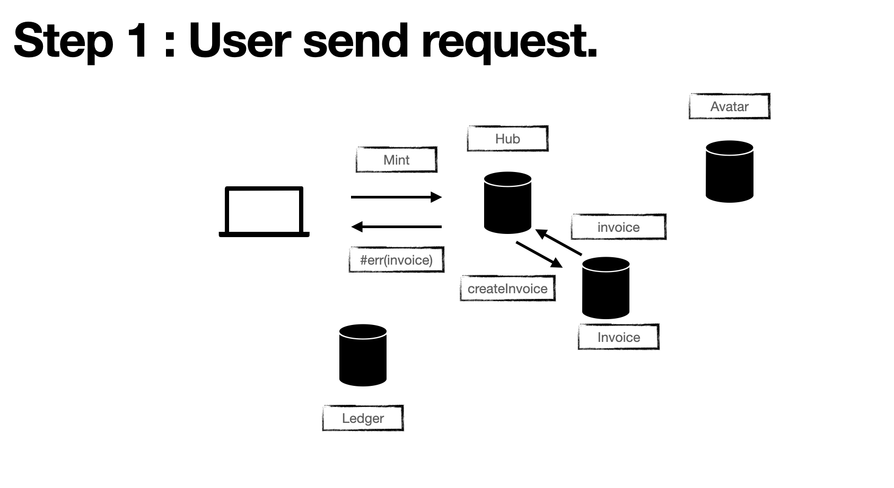
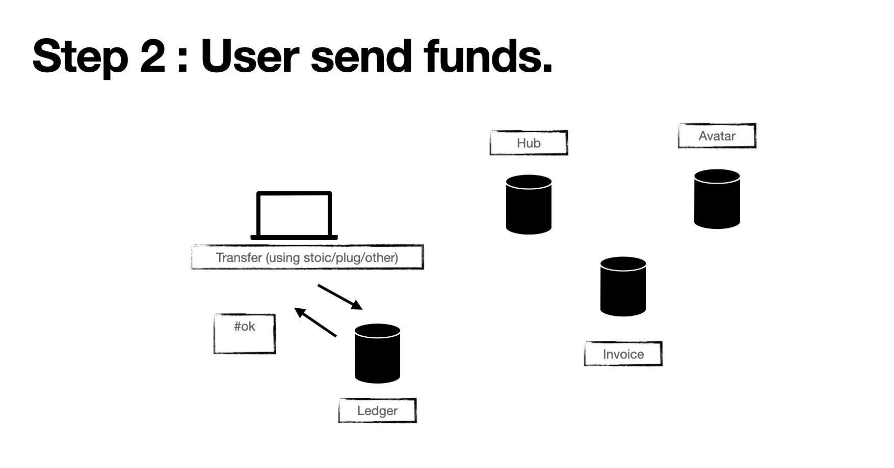
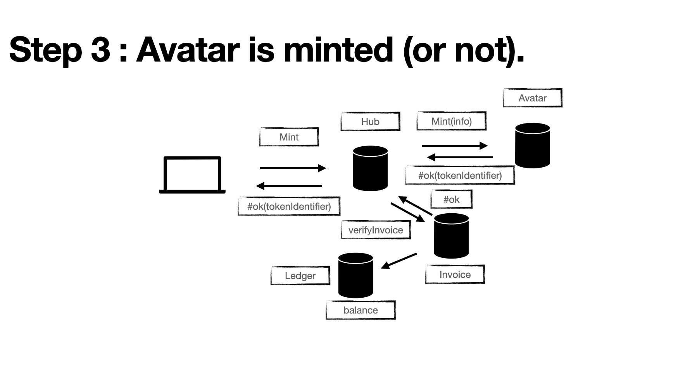

# Mint

1. User is on the webpage and play with the minter. <br/> Once he his ready, he sends a Mint request to the **Hub** canister (calling the mint endpoint).

```
mint :  (info : MintInformation) -> async MintResult;

public type  MintInformation = {
    background : Text;
    profile : Text;
    ears : Text;
    mouth : Text;
    eyes : Text;
    nose : Text;
    hair : Text;
    cloth : Text;
    colors : Colors;
};

public type MintResult = Result.Result<MintSuccess,MintErr>;

public type MintSuccess = {
    tokenId : Text;
};

public type MintErr = {
    #Anonymous;
    #AlreadyMinted;
    #Invoice: Invoice.Invoice;
    #InvoiceCanisterErr : Invoice.VerifyInvoiceErr or Invoice.CreateInvoiceErr;
    #AvatarCanisterErr : Text;
    #Other : Text;
};

public type Invoice = {
    id : Nat;
    creator : Principal;
    details : ?Details;
    permissions : ?Permissions;
    amount : Nat;
    amountPaid : Nat;
    token : TokenVerbose;
    verifiedAtTime : ?Time.Time;
    paid : Bool;
    expiration : Time.Time;
    destination : AccountIdentifier;
};

public type VerifyInvoiceErr = {
 message : ?Text;
    kind : {
      #InvalidInvoiceId;
      #NotFound;
      #NotYetPaid;
      #NotAuthorized;
      #Expired;
      #TransferError;
      #InvalidToken;
      #InvalidAccount;
      #Other;
    };
  };
};

public type CreateInvoiceErr = {
 message : ?Text;
    kind : {
      #BadSize;
      #InvalidToken;
      #InvalidAmount;
      #InvalidDestination;
      #InvalidDetails;
      #MaxInvoicesReached;
      #Other;
    };
};
```



The hub canister will check the status of the user and answer accordingly.

- User is anonymous : #Anonymous.
- User has already minted an avatar : #AlreadyMinted.
- User send a request for the first time : Will register the user and create an Invoice with Invoice canister then transfer the Invoice to the user trough the answer.
- User has already send a request and created an Invoice : see step 4

2. The user will pay the amount (1ICP to the account specified in the Invoice).

This step doesn't involve any communication with our fleet of canisters but is done on the client side using wallets (Plug/Stoic) and the **Ledger** canister.

Plug : Abstracted away (doesn't need to talk with the Ledger canister but uses their custom interface). <br/
Stoic : Need to create the **Ledger** actor and actually do the transfer for the user.



3. User send his second mint request.

The **Hub** canister will check the status of the invoice and if the invoice has been paid the mintInformations will be transmitted to the **Avatar** canister which is responsible for actually minting the token and creating the associated avatar.
Once the avatar canister is done he will answer and transmit the TokenIdentifier of the newly created avatar to the **Hub** canister that will answer back the user.



# User profile and avatar.

```
public type User = {
  email : ?Text;
  discord : ?Text;
  twitter : ?Text;
  rank : ?Nat64;
  height : ?Nat64;
  status : Status;
};


public type Status =  {
  #Invoice : Invoice.Invoice; // Invoice needs to be confirmed before being a member.
  #Member : Bool; // Boolean indicating if the user has minted his avatar.
  #InProgress; // A intermediate status to block re-entrancy attacks.
};

```

- Get the user profile :

Calling the hub canister (needs to be authenticated).

```
get_user :  () -> async User;

```

- Modify the user profile (needs to be authenticated).

```
modify_user(user : User) -> async Result<(), Text>;
```

- Get the avatar(s) :

  Calling the avatar canister. <br/>

```
tokens_id(aid : AccountIdentifier) -> async Result<[TokenIdentifier], CommonError>;

public type CommonError = {
  #InvalidToken : TokenIdentifier;
  #Other        : Text;
};

```

The account identifier is calculated using the Principal and the subaccount 0.

Note : It is possible that the user own multiple tokens : the current strategy is to only take into account the first one.

# Modify the avatar with accessories.

# Mint a new accessory.
