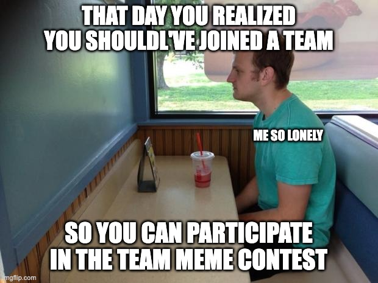
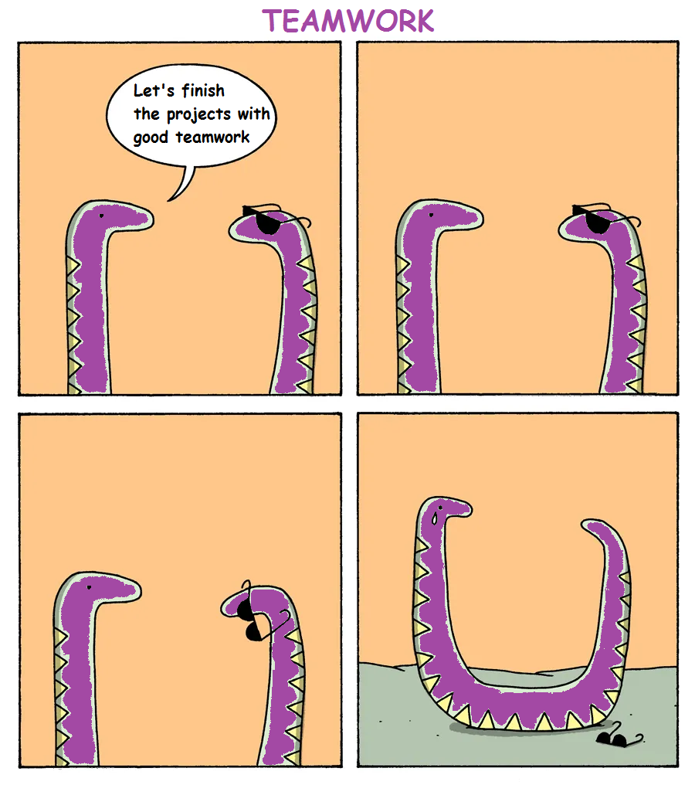

# 🎪 Events

Events are actions that are organized by the community and have a role and impact in the gameplay.

It can be fully online event or even physical events. They are usually the occasion to get your hand on special edition accessories & legendary characters.

### Branded merchandises

The internal economy is based on 6 materials. Those materials are the raw base for our economy and will be airdropped regularly trough our leaderboard and reward system.

.png>) .png>)  .png>) .png>) 

However, exist also what are known has **branded materials** & **branded accessories**.&#x20;

Those materials are a way to integrate and communicate with other ecosystems. Here's an example with two of the most popular projects on the Internet Computer : **Cronic** & **ICPunk**.

 

Those materials will be airdropped during **events. The goal of those events is to incentivise squad members to discover and play around with dApps of those ecosystems.**&#x20;

Those materials can later be used to create **branded accessories**. Those accessories have all the properties of normal accessories but they have a different card template that makes them super distinctive.&#x20;

You will also notice that the logo of the accessory is part of the card.&#x20;

The **recipes** for those accessories will require branded merchandise that will requires engagement with this ecosystem to get your hands on it. This is the best way to show your support for a team or a cool new dapp.

_In the future, each dapp will be free to create his own branded merchandise and offer special benefits to their fans._

### Community events

This game is part of a larger [community initiative](https://www.dfinitycommunity.com/introducing-dfinity-community/) that aims to make a big difference and impact in the world and help the IC grow.

This community has ambitions to organise a lot range of initiatives from hackathon, meetings, education or merchandise.

_This game will be used as a fun way to connect events and create a rich history of all initiatives_**.**

Events will make the game even more dynamic and living that is possible. It will generally be unique opportunities to win prizes, learn and meet other community members.

### History

**Motoko Bootcamp 2022 (March 5th - March 13th)**

Noticing the clear lack of talents and educational ressources in the ecosystem. Isaac had an idea to address this in the short-term.

After a few months of preparation and a **community grant** from _Dfinity this event was k_ickstarted on the 5th of March and lasted for 1 week. Everything took place online.

.png>)

This event was an incredible opportunities to learn to build dApps and to put together many members of the community. This also also the occasion to get some great **memes.**

.png>)  

If you want to learn more it here is a few ressources.

* [A student perspective on the Bootcamp.](https://www.dfinitycommunity.com/a-student-review-of-the-motoko-bootcamp/)
* The educational [repository](https://github.com/motoko-bootcamp/education).
* The official YouTube [channel](https://www.youtube.com/channel/UCa7\_xHjvOESf9v281VU4qVw) created for the event.

Now let's flex on a few way cool ways we used the Internet Computer and this game to make it even better. 😎

**Legendary avatars**&#x20;

All the mentors that participated and the winners of the final contest were offered a special avatars as prizes.

Add more mentors when I have the pictures available

**Diploma**

Our friend Isaac was not only an organiser from the bootcamp but he was also taking part as a student. Every student had to conduct a project during the week. He decided to build a minter [application](https://github.com/InternetComputerOG/motoko-bootcamp-diplomas) for creating NFT diplomas for all other students !

Those diplomas were minted after the event to all students that graduated from the event after passing the final test.

Using the application each student is free to set the color on the border of his diploma and uses his a profile picture.&#x20;

* If you see a diploma pulsing the color gold 🟨, that means they are open to receiving job offers for IC development.
* If you see a diploma pulsing the color blue 🟦, that means they are looking to hire an IC dev.

This diploma is bounded to the wallet it was minted into, meaning students cannot sell it. This makes it one of the first _**proof of devs skills.**_&#x20;

_This will be interesting to see if such awards can be used later to help us structure the community and put the skills of everyone at good use. We know for instance that many proposals on the NNS required high technical skills to be carefully reviewed. It could be interesting to use the Motoko Bootcamp students to help build a governance council for the squad and take technical decisions ?_&#x20;

**Special accessories**

To make things even more spicy all the graduated where offered special accessories that they can equip on their character : the **Mortaboard hat** & **Bootcamp soldier**.

.png>) .png>)

Those accessories are both 5 stars accessories, they can be traded or equipped on your avatar.&#x20;

The only difference is that they cannot be minted the traditional way. This will likely make them highly rare as they has been only 50 graduated students. 🤯

**DSCVR Portal**

Using the gated portal functionality from [DSCVR](https://h5aet-waaaa-aaaab-qaamq-cai.raw.ic0.app/) we created the [Motoko Bootcamp portal.](https://h5aet-waaaa-aaaab-qaamq-cai.raw.ic0.app/p/motoko-bootcamp)

The portal can only be accessed if you have your diploma. **We hope that every future edition will welcome new members in the portal.**

Here are some of the things that can be done in this portal.

* **🤝 Make Connections** | Find jobs, employees, volunteers, hackathon teammates, and co-founders.
* **🧪 Share Early Stage Work** | Get feedback, collect alpha testers, offer bug bounties, or just give the IC dev community a head start on your project.
* **🎁 Airdrop Gifts** | We can get a list of principals for you via DSCVR, or you could simply use the getRegistry query on the diploma canister (pgsou-iyaaa-aaaal-aaifq-cai).
* **🤫 Private Tech Discussions** | Let's make this portal a safe place to discuss topics outside of the general public. For example, a founder should be able to ask for help solving an issue with their project without having trolls spreading FUD about the issue. **(🚨 Those who share private information from posts or screenshots of posts may be banned. 🚨)**
* **🧑‍💼 Find or Offer Mentorship** | Let's support one another and build lasting relationships!
* **💭 Brainstorm Deep Topics** | How IC tech might be used to impact DAO governance, IT security, defi, social change, etc.

**Missions**&#x20;

Students didn't really knew it at the time they participated in the camp but in fact they were participating in one of the first **mission ever** of the game**.**

_A mission is an action that you have to take, something that you have to collect, something that you have to learn._&#x20;

By validating their participation in this camp, students will earn points in the leaderboard. This will be a temporary boost in their score. The name of this mission is **Motoko School.**

