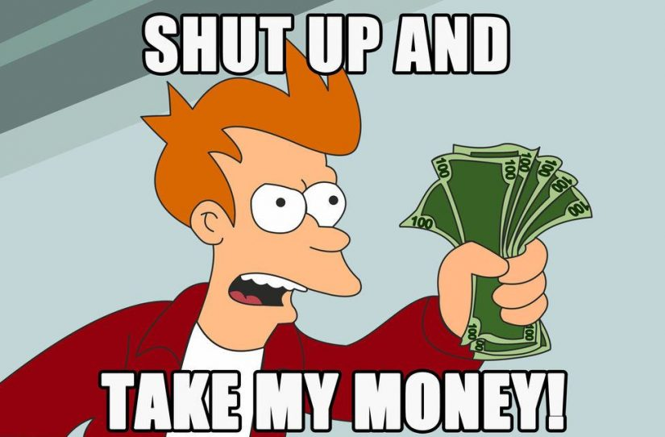

# 🦸♂ Legendaries

You might notice that some characters looks different. They are called **legendaries**, and they are really cool.

Those avatars are unique and offered as reward to celebrate special contributors & members in the ecosystem.&#x20;

### Benefits&#x20;

If you get your hands on one of those, not only you will get offered a unique piece of art but you will also get access to all the benefits associated with owning a **legendary character.**&#x20;

* Access to the legendary club on DSCVR, where you can have direct access to top stars of the community.
* Lifetime guarantee of having access to **free** minting of characters for all future seasons.&#x20;
* Boosted statistics compared to traditional avatars.

### How do I get one ?

I know what you are thinking at this point.&#x20;

Expect if you find someone ready to sell his own legendary avatar, which I highly doubt, this will not be possible that way.&#x20;

Legendary avatars **cannot be bought.** They are offered as rewards during events and for special contributors.

Your best luck is to participate regularly in events, make a name for yourself and believe me we will rush to create your legendary avatar.&#x20;

_During one of the latest event called the **Motoko Bootcamp**, the winners for the two tracks of the event (beginners & intermediate have been awarded a legendary avatar. Welcome to the cool kids club!_

 
